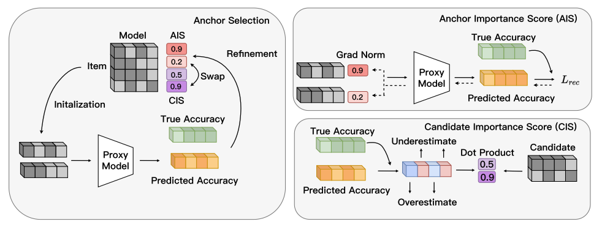
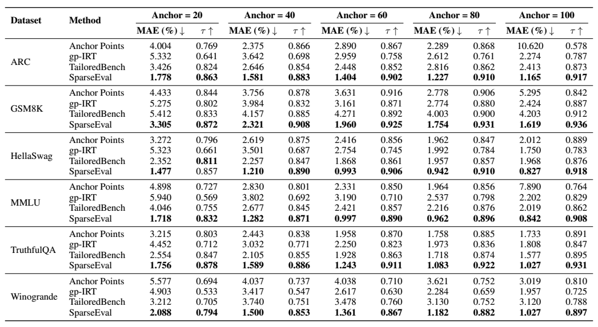

<h1 align="center">[ICLR2026] SparseEval: Efficient Evaluation of Large Language Models by Sparse Optimization</h1>

<p align="center">
<a href="https://arxiv.org/abs/2602.07909"></a>
<a href="https://huggingface.co/datasets/iridescentttt/SparseEval_preprocess_data"></a>
</p>

<p align="center">
<a href="#-introduction">📖 Introduction</a> • 
<a href="#-main-results">📊 Main Results</a> • 
<a href="#-getting-started">🚀 Getting Started</a> • 
<a href="#-citation">📜 Citation</a>
</p>

## 📖 Introduction

As large language models (LLMs) continue to scale, evaluating their capabilities on comprehensive benchmarks has become computationally expensive. *SparseEval* is a novel framework that formulates efficient evaluation as a sparse optimization problem.


Key contributions of SparseEval include:
- **Sparsity Discovery**: We reveal that evaluation matrices exhibit inherent sparsity, where a small subset of "anchor" items can effectively represent the entire benchmark.
- **Anchor Optimization**: We introduce a gradient descent-based method to optimize the weights of selected anchor points for accurate performance estimation.
- **Task-Aware Refinement**: We leverage a proxy model to iteratively refine anchor selection, ensuring high relevance to the downstream task.

<p align="center">
  
  <br> &nbsp;
  <em>Fig. 2: The overall framework of SparseEval.</em>
</p>


SparseEval enables efficient benchmarking by selecting the most informative samples, achieving a balance between computational efficiency and evaluation reliability.

## 📊 Main Results

### Evaluation Sparsity in LLM Benchmarks
Our analysis of model-item performance matrices reveals distinct clustering patterns (Evaluation Sparsity). As shown in our studies, items within the same cluster exhibit high similarity in model response patterns, allowing us to select representative anchors to predict performance on the full dataset accurately.

<p align="center">
  
  <br> &nbsp;
  <em>Fig. 1: Motivation of SparseEval.</em>
</p>

### Performance Comparison
SparseEval consistently outperforms traditional baseline methods (such as Random Sampling and K-means) in terms of accuracy-efficiency tradeoffs. As shown in the figure below, our method achieves superior performance across multiple metrics.

<p align="center">
  
  <br> &nbsp;
  <em>Fig. 3: Main Results of SparseEval.</em>
</p>


- **High Correlation**: Maintains a Kendall’s $\tau > 0.9$ with full benchmark scores while using significantly fewer samples.
- **Low Estimation Error**: Achieves significantly lower Mean Absolute Error (MAE) compared to baselines.
- **Efficiency**: Reduces inference costs by orders of magnitude (e.g., evaluating on only 100 instances) without sacrificing ranking consistency.

We demonstrate robustness across various benchmarks including MMLU, ARC, GSM8K, HellaSwag, TruthfulQA, and Winogrande.

## 🚀 Getting Started

### Data Preparation


Please download the data from Hugging Face:

- **`preprocess_data`** (Necessary): [Download Link](https://huggingface.co/datasets/iridescentttt/SparseEval_preprocess_data). Contains the processed data files ready for evaluation.
- **`benchmark_data`** (Optional): [Download Link](https://huggingface.co/datasets/iridescentttt/SparseEval_benchmark_data). Contains the raw, unprocessed prediction files.

**Supported Datasets**: `arc`, `gsm8k`, `hellaswag`, `mmlu`, `truthfulqa`, `winogrande`.

Place the downloaded folders in the root of the repository. The expected directory structure is:

```
.
├── benchmark_data/    # Raw prediction files (CSV, Optional)
├── preprocess_data/   # Processed data files (Tensor)
└── ...
```

### Running SparseEval
Execute the evaluation methods using the provided scripts. Experimental parameters (number of anchors, learning rates) can be modified within these scripts.

#### Main Method: SparseEval (MLP-based)
This is the primary method proposed in the paper, utilizing gradient-based optimization with an MLP predictor.
```bash
bash SparseEval/run/gd_cluster_mlp.sh <dataset_name> <num_anchors>
# Example: bash SparseEval/run/gd_cluster_mlp.sh gsm8k 100
```

#### Baselines
We provide several baseline methods for comparison:

**1. Optimization-based Linear Weighting**

Uses gradient descent to optimize weights for interpretable performance prediction.
```bash
bash SparseEval/run/gd_cluster_linear.sh <dataset_name> <num_anchors>
```

**2. Anchor Point Selection**

Selects representative samples and uses cluster sizes as weights.
```bash
bash SparseEval/run/gd_cluster_anchor_points.sh <dataset_name> <num_anchors>
```

**3. K-means Clustering**
```bash
bash SparseEval/run/gd_cluster_kmeans.sh <dataset_name> <num_anchors>
```

**4. Random Sampling**
```bash
bash SparseEval/run/gd_cluster_random.sh <dataset_name> <num_anchors>
```
Results (MAE, Kendall’s $\tau$) are saved in the `result_data/` directory.

### Viewing Results
You can view the aggregated results (Error and Tau) using the provided statistics script:
```bash
python SparseEval/stat/stat.py
```

## 📜 Citation
If you find this work helpful, please cite us.

```bibtex
@article{zhang2026sparseeval,
  title={SparseEval: Efficient Evaluation of Large Language Models by Sparse Optimization},
  author={Zhang, Taolin and Guo, Hang and Lu, Wang and Dai, Tao and Xia, Shu-Tao and Wang, Jindong},
  journal={arXiv preprint arXiv:2602.07909},
  year={2026}
}
```
